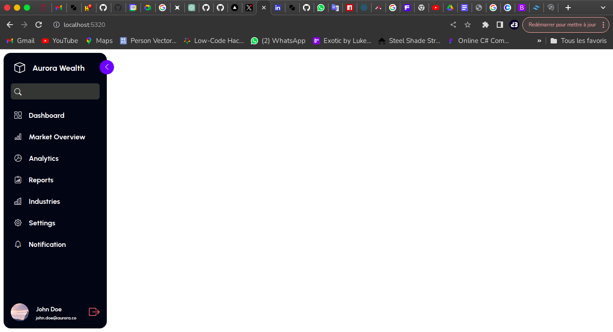

# Animated Sidebar Example

This is an example of how you can make a sidebar with a nice open/close animation using **Rasengan Framework** and **TailwindCss**

## Demo

Click on the image below to see the demo video 👇

## Links

- Portfolio: [dilane3.com](https://dilane3.com)
- Twitter: [@DilaneKombou](https://twitter.com/DilaneKombou)
- LinkedIn: [Dilane3](https://www.linkedin.com/in/dilane3-6824b2207/)
